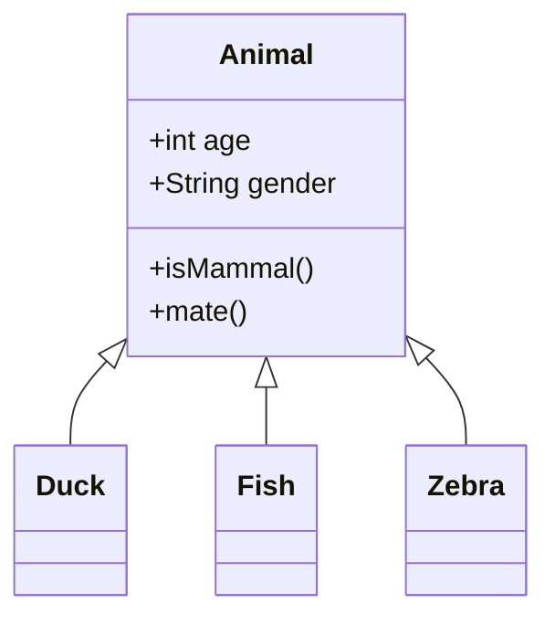

+++
date = '2026-03-26T20:30:00+08:00'
draft = true
title = 'Homelab'
+++

#My homelab setup

As part of my ongoing review for Redhat Certifications. I need to have a lab environment that i can deploy, destroy and redeploy.

My requirements for the lab are:

- Easy deployment, destroy and redeploy
- Configuration like ssh keys, packages requirements and OS updated
- 1 VM will have additional disk

#Lab Diagram




## Laptop spec
```
Processor:
Disk:
Memory: 32Gb

```
